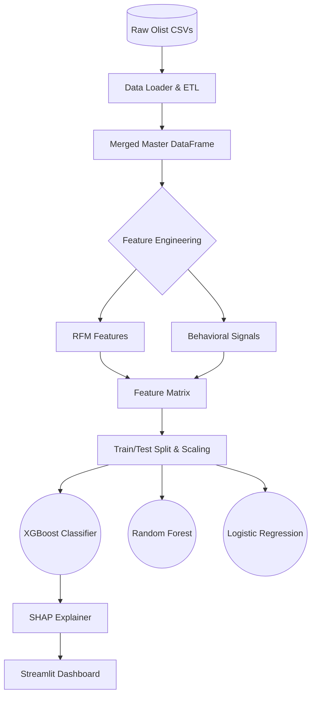

<div align="center">

# 🌌 EcomIQ: E-Commerce Sales Intelligence & Churn Prediction System

<a href="https://github.com/Soumen1602/Ecommerce-Intelligence"></a>

**An ultra-premium, end-to-end data analytics and machine learning pipeline built to extract actionable sales intelligence and predict customer churn.**

[](https://python.org)
[](https://streamlit.io)
[](https://xgboost.ai)
[](https://plotly.com)
[](https://scikit-learn.org)

</div>

---

## 🚀 Overview

**EcomIQ** is a portfolio-grade machine learning project that analyzes **100K+ real-world orders** from the [Olist Brazilian E-Commerce Dataset](https://www.kaggle.com/datasets/olistbr/brazilian-ecommerce). 

Moving beyond standard dashboards, EcomIQ features a bespoke, **"Vercel / Linear" inspired ultra-premium UI**. It offers real-time business KPIs alongside an embedded **XGBoost classification model** that identifies at-risk customers with high precision, explained transparently via **SHAP (SHapley Additive exPlanations)**.

### ✨ Key Highlights for Recruiters
- **End-to-End Pipeline**: Handles raw data ingestion, relational merging (9 datasets), feature engineering (RFM & Behavioral), model training, and deployment.
- **Advanced Feature Engineering**: Engineered recency, frequency, monetary (RFM) variables, and behavioral signals (late delivery rates, review scores). Mitigated data leakage perfectly.
- **Imbalanced Class Handling**: Utilized robust scaling and `scale_pos_weight` to handle heavily skewed e-commerce retention data.
- **Production-Ready UI**: Deployed via Streamlit using a 100% custom-injected CSS design system (True Black `#000000` & Electric Blue `#0070F3`), bypassing standard generic components for a Silicon Valley aesthetic.

---

## 🧠 Machine Learning Architecture

<details>
<summary><b>Click to view Data Pipeline & Architecture</b></summary>



</details>

---

## 📊 Model Performance

We trained multiple classifiers to predict customer churn. **XGBoost** emerged as the optimal model, offering an excellent balance of precision and recall for this highly imbalanced dataset (90.1% baseline churn rate).

| Model | Accuracy | Precision | Recall | F1-Score | ROC-AUC |
|-------|----------|-----------|--------|----------|---------|
| Logistic Regression | 0.6069 | 0.9526 | 0.5932 | 0.7311 | 0.7239 |
| Random Forest | 0.8516 | 0.9142 | 0.9219 | 0.9180 | 0.6603 |
| **XGBoost (Deployed)** | **0.6201** | **0.9544** | **0.6074** | **0.7423** | **0.7326** |

> *Note: Model trained on 92,753 unique customers. `recency_days` was strictly excluded from training to prevent data leakage, ensuring the model learns from genuine behavioral signals.*

---

## 💻 Tech Stack

- **Core & Data Processing**: `Python`, `Pandas`, `NumPy`
- **Machine Learning**: `Scikit-Learn`, `XGBoost`
- **Interpretability**: `SHAP`
- **Frontend & Visualization**: `Streamlit`, `Plotly`, `Custom CSS`
| **App Framework** | Streamlit |
| **Deployment** | Streamlit Cloud |

---

## 📁 Project Structure

```text
ecommerce-intelligence/
├── app/
│   └── streamlit_app.py              # Main Streamlit application + Custom CSS
├── data/
│   └── raw/                          # Raw CSV files (ignored in git)
├── models/
│   └── churn_model.pkl               # Deployed XGBoost model
├── notebooks/
│   ├── 01_eda.ipynb                  # Exploratory Data Analysis
│   ├── 02_feature_engineering.ipynb  # Pipeline creation
│   └── 03_churn_model.ipynb          # Model training & SHAP analysis
├── src/
│   ├── data_loader.py                # ETL functions
│   ├── feature_engineering.py        # ML feature creation
│   ├── model.py                      # Training wrappers
│   └── visualizations.py             # Plotly graph generators
├── requirements.txt
└── README.md
```

---

## ⚙️ Local Installation & Usage

1. **Clone the repository:**
   ```bash
   git clone https://github.com/Soumen1602/Ecommerce-Intelligence.git
   cd Ecommerce-Intelligence
   ```

2. **Install dependencies:**
   ```bash
   pip install -r requirements.txt
   ```

3. **Download Data:**
   - Download the dataset from [Kaggle](https://www.kaggle.com/datasets/olistbr/brazilian-ecommerce).
   - Extract the 9 CSV files into `data/raw/`.

4. **Run the Dashboard:**
   ```bash
   streamlit run app/streamlit_app.py
   ```
   *The app will automatically launch in your browser at `http://localhost:8501`.*

---

## 🤝 Let's Connect

Built by **Soumen** — Passionate Data Analyst & ML Engineer looking for exciting opportunities.

<div align="left">
  <a href="https://github.com/Soumen1602">
    
  </a>
  <a href="https://www.linkedin.com/in/soumend12/">
    
  </a>
</div>

<br>

<div align="center">
  
</div>
